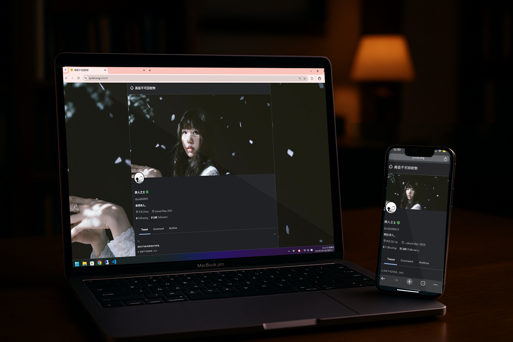

micro-twitter
=================

## English
### Deployment Guide

1. Ensure PHP >= 7.4
2. Edit */config_auth.php*
3. Rename */auth/index.php.bak* to */auth/index.php*
4. Update the value of `$account`
5. Open *http://yourdomain/auth/index.php*, scan the QR code using mobile apps like GoogleTM Authenticator, and enter the code to bind your account
6. Copy the **SECRET** displayed on the page into */auth/config.php*, replacing `$TOTP_SECRET`
7. Rename */auth/index.php* back to */auth/index.php.bak*

### Notes
Verification page: */auth/verify.php*

Publishing page: */auth/post.php*

Visitor format: *http://yourdomain/?key=allowed_key*

*/images/private* is not encrypted, handle it manually

No database is required; all operations are file-based. Therefore, files like **x2505.php** need to be created manually.

My blog: [卡库伊2.0](https://blog.kkii.org)

## 中文
### 部署指南

1. PHP >= 7.4
2. 修改 */config_auth.php*
3. 重命名 */auth/index.php.bak* 为 */auth/index.php*
4. 修改`$account`的值
5. 访问*http://yourdomain/auth/index.php* ，使用GoogleTM Authenticator 等移动端APP扫码，输入code，即可绑定
6. 将页面上显示的**SECRET**复制到 */auth/config.php* 替换掉`$TOTP_SECRET`
7. 重命名 */auth/index.php* 为 */auth/index.php.bak*
### 提示
验证页：*/auth/verify.php*

发布页：*/auth/post.php*

访客格式：*http://yourdomain/?key=allowed_key*

*/images/private* 没有加密，自己处理

无需数据库，直接对文件操作。所以**x2505.php**等需要手动创建。

我的博客:[卡库伊2.0](https://blog.kkii.org)。